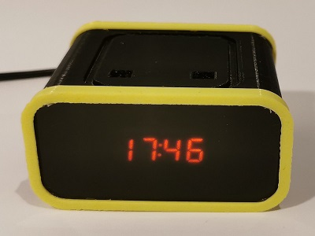

A simple night clock activated by waving a hand over it. It was born by the desire to see the current time at night without being blinded by a mobile phone screen. The dim, red LED display prevents illuminating the room when the clock is activated, a fetaure common in all the good old alarm clocks.

The Night Clock is equipped with a battery backed DS3231 to provide timekeeping even when the USB cable is unplugged. A VL53L0X TOF sensor detects hand movement and triggers the time display for a set time. Additionally an APDS9960 light sensor allows to run the display at a luminosity suitable for the current ambient light. The 7-segment displays are driven by a TM1637, reducing the need to wire wrap a ton of segments and to provide multiplexing.

The device is USB powered and has no internal battery (other than the CR2025 to keep the time) as I didn't want to have to deal with one more gadget running flat.

There's a plan on the backburner to use the APDS9960 gesture detection ability to provide a time setting interface. At the moment the only way to set the time is through the USB port (uploading a temporary Arduino sketch that sets the clock...I know, it's barbaric!).

